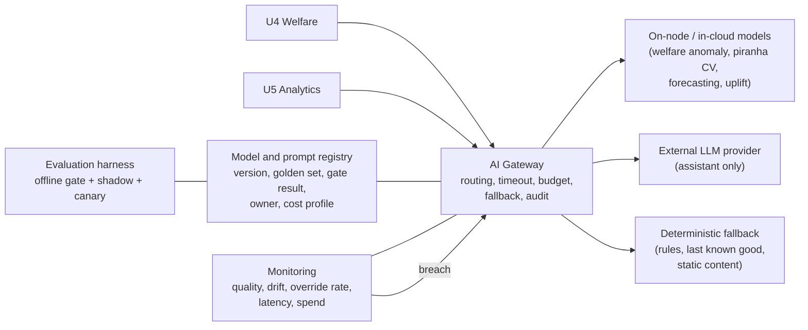

# AI Services

AI Services is a **gateway plus a library**, not a platform team's product. It exists to
make five things true for every capability in [../02-ai-capabilities/](../02-ai-capabilities/),
with no per-capability reinvention:

1. A capability can be switched off and the business function still works (NFR-AI-1).
2. No model reaches production without passing a gate (NFR-AI-2).
3. Every output is explainable enough to argue with and is retained (NFR-AI-3).
4. Degradation, drift and cost breaches are detected and acted on automatically (NFR-AI-4, NFR-COST-1).
5. A provider can be replaced on a known schedule at a known cost (NFR-MOD-1).

Sizing note: this serves at most five capabilities and two engineers. Every component
below is justified by a capability that exists in the plan, not by a reference
architecture. See ADR-0002 for why it is not a separate unit.

## Structure



Legend: solid lines are call paths; plain lines are control-plane relationships. The
`FB` box is reachable from the gateway on every path, which is the structural expression
of NFR-AI-1.

## Components

| Component | What it does | What it deliberately does not do |
| --- | --- | --- |
| AI Gateway | Single entry point for every model call. Applies timeout, retry policy, per-capability budget, provider routing, and fallback selection. Writes the audit record. | It is not a general inference server. It does not host models; it calls them. |
| Model and prompt registry | For each capability version: artefact or provider and model id, prompt version, golden set id, gate results, owner, expected cost per 1,000 calls, rollback target. Backed by a table plus object storage. | It is not an experiment tracker or a feature store. Experiments live in notebooks; features live in curated analytics tables. |
| Evaluation harness | Runs the offline gate against golden sets, drives shadow comparison against the incumbent, and produces the promotion decision as a signed artefact. Runs in CI. | It does not decide. A named human approves the promotion using the artefact. See ADR-0007. |
| Monitoring | Tracks quality proxies, input drift, human override rate, latency, error rate and spend per capability. | It does not compute ground truth. Ground truth arrives late, from human actions, and is handled per capability. |
| Fallback registry | The declared deterministic behaviour for each capability, tested in CI like any other code path. | It is not a "graceful error message". A fallback is a working business behaviour. |

## The output contract

Every capability returns the same shape, and consumers are written against it:

```
{
  capability: "welfare-anomaly",
  version: "2024.11.3",
  result: <domain payload>,
  confidence: 0.0 .. 1.0,
  basis: [ <evidence references: readings, frames, features, source documents> ],
  fallback_used: true | false,
  latency_ms: <int>,
  cost_units: <int>
}
```

Consequences that this contract forces:

| Consequence | Why it matters |
| --- | --- |
| A UI cannot show a model result without being able to show why. | Keepers reject alerts they cannot interrogate; see [stakeholders](../00-problem/stakeholders.md). |
| `fallback_used` is a first-class metric, not a log line. | It is how we measure whether the degradation ladder is actually working ([FF-16](../04-verification/fitness-functions.md#ff-16)). |
| `confidence` drives routing to a human, per capability thresholds. | ADR-0010. |
| The record is retained 12 months. | NFR-AI-3, and it is the training data for the next version. |

## Confidence bands

Bands are set per capability, in its own file, and they are always three:

| Band | Behaviour | Who acts |
| --- | --- | --- |
| High | Act automatically, log the action | System, reviewed weekly in aggregate |
| Middle | Present to a human as a suggestion with evidence | Keeper, vet, operations manager |
| Low | Discard from the active path, retain for audit and for the weekly missed-signal review | Nobody in the moment; the weekly review looks for false negatives here |

The low band is where most designs lose information. We keep it and audit it, because the
question "what did we throw away" is the only cheap way to estimate false negatives before
ground truth arrives. See [../04-verification/ai-validation.md](../04-verification/ai-validation.md).

## Provider independence

| Rule | Detail |
| --- | --- |
| Two-provider rule | Any capability using an external provider must have a second provider configured and evaluated on the same golden set. Applies only to [cap-05](../02-ai-capabilities/cap-05-guest-companion.md) today. |
| Prompts are versioned artefacts, not strings in code | A provider swap changes the prompt version, and the prompt version is re-evaluated. This is where the real switching cost sits. |
| Failover drill | A quarterly exercise routes production traffic to the secondary provider for one day and records quality delta and cost delta. | 
| Honest cost | Switching is not free. The drill exists to keep the number in NFR-MOD-1 measured rather than asserted. ADR-0008. |

## Budgets

Each capability declares a monthly spend ceiling. The gateway enforces it in three steps:
alert at 70%, restrict to high-value calls only at 90%, and route to the deterministic
fallback at 100%. The ceiling is a configuration value with an owner, and breaches are
reviewed at the phase gate. See ADR-0014 and
[../03-delivery/cost-model.md](../03-delivery/cost-model.md).

## Why this is small

A reader familiar with larger AI platforms will notice the absence of a feature store, a
vector database cluster, an agent orchestration framework and a model serving mesh. Each
absence is a decision:

| Absent | Why, for this client |
| --- | --- |
| Feature store product | Three models share perhaps a dozen features. A versioned table plus a naming convention costs a day and no operations. |
| Self-hosted vector database | The assistant corpus is a few thousand short documents (opening times, species facts, safety rules). An embedded index rebuilt nightly is enough, and it fits in the deployable. ADR-0016. |
| Agent framework with tool calling | No capability in our portfolio needs multi-step autonomy. Adding agency would add failure modes we cannot verify with two engineers, and criterion 6 asks how we validate. We would rather ship five verifiable capabilities than one impressive one. See [../05-process/decision-log.md](../05-process/decision-log.md) D3. |
| Fine-tuning pipeline | We have no proprietary text corpus worth fine-tuning on, and retrieval solves the grounding problem more cheaply and more auditably. ADR-0016. |
