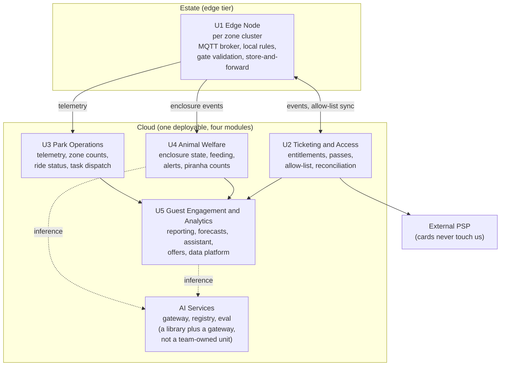

# Decomposition

Five units. One runs at the edge, four are modules of one cloud deployable. The count is a
decision, not an accident: see ADR-0002 and the disagreement recorded in
[../05-process/decision-log.md](../05-process/decision-log.md) D2.

## The units

Legend: solid arrows are the normal data path; dashed arrows are model calls that always
have a deterministic fallback (NFR-AI-1); the double arrow is bidirectional and survives
disconnection by design (ADR-0003). Boxes inside CLOUD are modules of a single deployable,
not separate services.

## Boundaries, ownership and profile

| Unit | Owns (data) | Does not own | Why the boundary is here | Top characteristic |
| --- | --- | --- | --- | --- |
| U1 Edge Node | Local entitlement allow-list (a replica), unsent telemetry buffer, local rule state | The authoritative ticket ledger; any visitor identity | The boundary is the network. Everything that must work while disconnected is on this side of it. | Fault tolerance |
| U2 Ticketing and Access | Entitlements, passes, orders, redemptions, reconciliation outcomes | Card data (external PSP, NFR-SEC-1); visitor behavioural data | Money and admission rights need strong consistency and an audit trail; nothing else in the system does. | Correctness and auditability |
| U3 Park Operations | Zone counts, device inventory and health, ride status, operational tasks | Visitor identity; animal clinical data | Operational data is anonymous, high-volume and tolerant of loss; welfare data is neither. | Throughput |
| U4 Animal Welfare | Enclosure readings, feeding records, welfare alerts, piranha population estimates, keeper and vet actions | Visitor data; commercial data | Different users (keepers, vet), different urgency, different sensitivity, and a safety obligation that U3 does not carry. | Alert reliability |
| U5 Guest Engagement and Analytics | Aggregates, forecasts, opt-in visitor profiles, assistant corpus, model artefacts | Any source-of-truth operational record; it reads, it does not write back | Highest change rate and the only unit holding personal data. Isolating it keeps the privacy blast radius small and lets it be rebuilt or replaced without touching operations. | Changeability |

## Why not more units

| Candidate split | Rejected because |
| --- | --- |
| Ticketing / Passes / Access as three units | They share one consistency boundary. Splitting them creates a distributed transaction over the thing that must never be wrong. |
| Rides as its own unit | 40 rides, status reporting only (C5). It is a table and a screen, not a domain. |
| Feeding separate from Welfare | Same users, same data, same day. Splitting them would double the coordination for one keeper team. |
| A separate AI platform unit | AI Services is a gateway plus a library used by U4 and U5. Making it a unit implies an owning team; there is none (A7). It is versioned with the cloud deployable. See [ai-platform.md](ai-platform.md). |
| Notification / identity / audit as shared services | These are cross-cutting concerns, and the client cannot staff platform work. They are libraries inside the deployable with a single owner. |

## Why not fewer units

| Candidate merge | Rejected because |
| --- | --- |
| Merge U4 into U3 | The welfare alert path has a safety obligation (C6) and a different availability requirement. Merging them means an analytics deploy can break an animal alert. |
| Merge U5 into U3 | U5 holds personal data and changes weekly. Merging widens the privacy blast radius and couples the fastest-changing code to operations. |
| Put U1 logic in the cloud and keep dumb devices | This is the rejected style in [style-decision.md](style-decision.md). It violates NFR-AVAIL-1. |

## Data ownership rules

| Rule | Consequence |
| --- | --- |
| One writer per data set. Other units read through a published interface or by subscribing to events. | No shared-database coupling between modules, even though they share a deployment. |
| The edge holds replicas, never originals, with one exception: telemetry that has not yet been forwarded. | Losing an edge node loses at most the unforwarded buffer, and NFR-DATA-1 bounds that at 72 hours of local retention. |
| Personal data exists only in U5, only after opt-in, and only behind a pseudonymous key issued by U2. | Erasure (NFR-PRV-2) is a single-unit operation. |
| Model training data is derived from the event log, never from a live operational store. | Retraining cannot slow down or corrupt operations. |

## Requirement to unit map

| Unit | Requirements |
| --- | --- |
| U1 | FR-3, FR-4 (local half), FR-7 (sensing and local rules), FR-11 (offline task delivery) |
| U2 | FR-1, FR-2, FR-3 (authoritative half), FR-4, FR-16 (pseudonym issuance) |
| U3 | FR-5, FR-6, FR-11 |
| U4 | FR-7, FR-8, FR-9, FR-10 |
| U5 | FR-12, FR-13, FR-14, FR-15, FR-16 |

Full traceability lives in [../00-problem/requirements.md](../00-problem/requirements.md).
