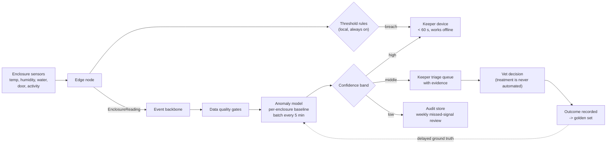

# cap-01: Animal welfare anomaly detection

Requirement FR-10. Objective O4. Ships in Phase 2. Type: classical ML on multivariate
sensor time series.

## Why a rule is not enough

The rule ships first and stays forever. Phase 1 gives every enclosure threshold rules set
by the head keeper: temperature outside a species band, humidity outside a band, water pH
or dissolved oxygen outside a band, a door left open, a sensor gone silent. Those rules
catch acute, fast, obvious conditions, and they run locally within 60 seconds (NFR-PERF-2).

What they cannot catch:

| Case a threshold misses | Why |
| --- | --- |
| A slow drift inside the safe band. Water temperature rising 0.4 C a day for a week, never crossing the limit, while the animal stops eating. | No single reading is out of range. The pattern is the signal. |
| A combination that is only bad together. Humidity at the low end plus temperature at the high end plus reduced activity. | Each threshold would have to be tightened, and tightening any one of them alone produces alerts on ordinary days. |
| A change relative to *this* enclosure's normal, which differs from the species band. | 55 enclosures with different occupants, positions, sun exposure and equipment. Per-enclosure thresholds would mean 55 hand-tuned rule sets that nobody has time to maintain. |
| Deviation from the animal's own recent baseline. | The band is about the species; the signal is about the individual. |

That is the case for a model: **learn each enclosure's normal, flag deviation from it, and
leave the safety floor to the rules.** If the head keeper's thresholds could be tuned to
catch the four cases above without flooding the keepers, we would tune them and skip this
capability. The Phase 1 alert data is what tells us whether that is true, and the Phase 1
exit criterion measures the alert rate specifically so that this question has an answer.

## Design

Legend: the top path (sensors, rules, keeper) is the Phase 1 safety floor and never depends
on the model or the cloud. The lower path is the Phase 2 enrichment. The dotted line is the
feedback loop that makes the golden set grow.

| Element | Choice | Reason |
| --- | --- | --- |
| Model | Per-enclosure baseline model over rolling feature windows, one small model class shared across enclosures with per-enclosure parameters | 55 enclosures, sparse positives. One architecture, many fits, is maintainable by a contractor and operable by nobody in particular. A deep sequence model would need labels we do not have. |
| Placement | Cloud, batch every 5 minutes | The acute path is already local and fast. Slow-developing conditions do not need second-level latency, and cloud placement keeps the edge node simple. Cost: 120 EUR/month, independent of attendance. |
| Features | Rolling statistics per metric, deviation from the enclosure's own trailing baseline, feeding adherence from FR-8, time since last keeper visit | All available from Phase 1 data. No feature requires new hardware. |
| Output | `WelfareAlert` with `source: "model"`, a reason naming the contributing metrics, and the evidence window | The keeper must be able to argue with it. An alert that cannot be interrogated gets ignored, and an ignored alert system is worse than none. |

## Confidence bands

| Band | Threshold (assumption, calibrated in shadow) | Behaviour |
| --- | --- | --- |
| High | >= 0.85 | Alert the keeper directly, alongside rule alerts |
| Middle | 0.55 - 0.85 | Enters the triage queue with evidence; a keeper decides whether to look |
| Low | < 0.55 | Discarded from the active path, retained; sampled weekly for the missed-signal review |

## Data

| Aspect | Detail |
| --- | --- |
| Training data | 6 months of `EnclosureReading` and `FeedingRecorded` events from Phase 1, per enclosure |
| Labels | Welfare events with outcomes, labelled by the head keeper and the vet. Assumption: about 20 positives by month 9. |
| Ground truth in production | Treatment records and keeper confirmations, arriving days to weeks after the alert |
| The label problem, stated plainly | Twenty positives is very few. It is enough to gate on recall for the event types represented and not enough to claim generality. We therefore ship with a high recall target and a modest precision target, keep the rules underneath, and grow the golden set. We do not claim more. |

## Uncertainty

| Source | Handling |
| --- | --- |
| Rare positives, wide confidence interval on every quality claim | Recall threshold set high, precision threshold set low (0.60), and the keeper alert-rate cap is what actually protects the humans. |
| Different species, one model class | Per-enclosure parameters. If a group of enclosures performs badly, they are excluded and stay on rules; exclusion is a supported state, not a failure. |
| Seasonal drift (summer versus winter normals) | The first winter will look anomalous. This is explicitly expected: the baseline window is rolling, the first seasonal transition is monitored, and we widen the middle band for the transition rather than suppress alerts. |
| A stuck sensor looks like a perfectly stable animal | Data quality gates reject flatlines before the model sees them ([../04-verification/test-strategy.md](../04-verification/test-strategy.md)). This is the failure mode most likely to produce confident silence. |

## Validation and verification

| Stage | Criterion |
| --- | --- |
| Offline gate | Recall >= 0.90 on held-out labelled events; precision >= 0.60; calibration error <= 0.05 |
| Beat the fallback | Must flag at least 3 events the Phase 1 rules missed, each confirmed genuine |
| Shadow | 4 weeks, outputs invisible to keepers, disagreements adjudicated by the head keeper |
| Alert budget | No more than 3 additional non-actionable alerts per keeper per day at the chosen threshold, averaged over 2 weeks. **This is the gate that actually protects the deployment**, because it is the one the keepers feel. |
| Approver | Head keeper, not an engineer |
| Production monitoring | Keeper override rate; weekly sample of low-band discards; delayed ground truth from treatment records; input drift |
| Automatic rollback | Override rate above 40% over 2 weeks, or drift beyond the calibrated bound, rolls back to the previous version or to rules-only |

Full mechanism in [../04-verification/ai-validation.md](../04-verification/ai-validation.md).

## Degradation ladder

| Level | State | Behaviour | Who notices |
| --- | --- | --- | --- |
| 0 | Everything works | Rules plus model, bands active | - |
| 1 | Model degraded or drifting | Automatic rollback to the previous version | Engineer, next business day |
| 2 | No qualified model version | Rules only, capability marked degraded on the dashboard | Keepers see a banner; nothing they do changes |
| 3 | Cloud unreachable | Rules only, running on the edge node, alerts over local Wi-Fi and SMS | Keepers see "offline since HH:MM" |
| 4 | Edge node dead | Keepers revert to manual rounds for that cluster; the missing heartbeat pages on-call | Everyone |

Levels 2 and 3 are the same experience for a keeper, which is the point: the model is an
improvement on a system that already works, not a dependency of it.

## Alternatives considered

| Alternative | Why not |
| --- | --- |
| Tighter per-enclosure threshold rules only | 55 hand-tuned rule sets with nobody to maintain them, and still blind to multivariate and drift cases. We keep the simple version as the permanent floor. |
| Deep sequence model per enclosure | Needs orders of magnitude more labelled events than will exist by year three. Unverifiable here, which fails criterion 6. |
| Camera-based behaviour analysis (posture, movement, feeding behaviour) | Genuinely promising and genuinely expensive: cameras in 55 enclosures, a labelling effort in an area where no pretrained model knows these species, and night vision. Deferred, not rejected: revisit when the sensor-based capability is calibrated and the estate can afford the labelling. Recorded in [../05-process/decision-log.md](../05-process/decision-log.md) D7. |
| A veterinary AI product | None exists for a mixed exotic collection at this scale, and one that did would still need this estate's baselines. |
| Continuous online learning | Removes the human gate that the entire design depends on, and there is nobody to supervise it. |
