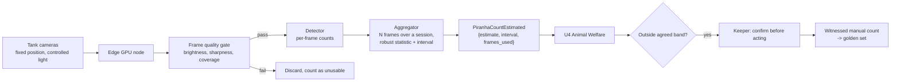

# cap-02: Piranha population estimation

Requirement FR-9, stated directly in the brief (F9: "control of the piranha population").
Objective O4. Ships in Phase 1, month 7. Type: computer vision, detection and counting.

## Why a rule is not enough

There is no rule to write, because there is no number to apply it to. The estate cannot
currently answer "how many piranhas are in this tank". Everything downstream of that
question, feeding volume, breeding control, whether the population is growing, is
guesswork until the number exists.

The deterministic alternative is a manual count, and it is what happens today:

| Manual counting | Problem |
| --- | --- |
| Counting by eye through glass | The animals move, overlap and, per the brief, jump. Counts disagree between people and between attempts. |
| Netting and counting | Stressful for the animals, dangerous for the keeper, and not repeatable weekly. |
| Counting at feeding | Only the ones that come to feed, which is exactly the biased sample that hides a problem. |

So the case for CV is not "a model is more accurate than a person". It is **frequency**: a
model can produce a consistently biased estimate every day, and a consistent bias with a
known interval is far more useful for detecting population *change* than an unbiased count
performed twice a year. We say this explicitly because it changes what we measure: the
target is a stable, repeatable estimate with a stated interval, not a true count.

## Design

Legend: inference runs entirely on the edge GPU node; no tank video leaves the estate. The
manual count on the right is both the confirmation step and the source of ground truth.

| Element | Choice | Reason |
| --- | --- | --- |
| Camera | Fixed position, fixed framing, controlled artificial light, one or two per tank | Fixed geometry is what makes counting tractable. Changing the framing invalidates the calibration, so the mounts are documented as fixed assets. |
| Model | Open-source detection backbone, fine-tuned on our labelled frames | The backbone is commodity; the labels are the asset. See [../03-delivery/build-vs-buy.md](../03-delivery/build-vs-buy.md). |
| Placement | Edge GPU node, on the estate | Continuous video to the cloud would cost more in bandwidth than the GPU costs once, and the uplink is the scarce resource (F10). Fixed CapEx of 3,500 EUR, zero per-call cost. |
| Estimation | Many frames per session, a robust statistic across frames, and a reported interval | A single frame undercounts by occlusion. Aggregation across frames is where the accuracy comes from, and it is deterministic code, not model magic. |
| Output | An estimate with an interval, never a bare number | A bare number invites false confidence about a quantity we cannot measure exactly. |

## Data

| Aspect | Detail |
| --- | --- |
| Training data | Frames from the estate's own tanks, collected from camera installation (month 5) onward. Assumption: about 3,000 labelled frames. |
| Labels | Bounding boxes drawn by the delivery team on estate frames. Assumption: about 5 person-days. |
| Golden set | 40 sessions with witnessed manual counts across 2 tanks and 4 lighting conditions |
| Ground truth uncertainty | The manual count is itself uncertain. We record the spread across repeated manual counts and never claim model accuracy tighter than that spread. |
| Cold start | 8 weeks from camera installation to a usable model, which is why this ships in month 7 and not month 4. |

## Uncertainty

| Source | Handling |
| --- | --- |
| Occlusion: fish behind fish | Multi-frame aggregation; the interval widens when frames disagree |
| Turbidity, algae, lighting change | Frame quality gate discards bad frames and counts them; a session with too few usable frames produces no estimate rather than a bad one |
| Juveniles versus adults | Size classes reported separately where the detector can distinguish them; if it cannot, the estimate is adults-only and labelled as such |
| Population change versus model drift | Both look like a moving number. This is the central ambiguity of the capability. Handling: a monthly witnessed manual count anchors the estimate, and a divergence between the model trend and the anchor triggers investigation before anyone acts on the trend. |
| Acting on a wrong number | No population action is ever taken from the model alone. The alert triggers a witnessed manual count, and the keeper acts on that. |

## Validation and verification

| Stage | Criterion |
| --- | --- |
| Offline gate | Estimate within 10% of the witnessed manual count on the held-out golden set, across all four lighting conditions |
| Repeatability | Two sessions on the same tank within an hour agree within 5%. Repeatability matters more than accuracy here, because the business question is change over time. |
| Beat the fallback | The fallback is a manual count every few months. The model must produce a usable estimate at least weekly with the accuracy above. |
| Shadow | Runs for 4 weeks producing estimates that only the delivery team sees, compared against 2 manual counts |
| Approver | Head keeper |
| Production monitoring | Monthly anchor count; usable-frame rate per session; estimate variance across sessions |
| Automatic rollback | Usable-frame rate below 50% for a week, or a divergence from the monthly anchor beyond 15%, disables the capability and reverts to scheduled manual counts |

## Degradation ladder

| Level | State | Behaviour |
| --- | --- | --- |
| 0 | Working | Daily estimate with interval; alert when outside the agreed band |
| 1 | Frame quality poor (algae, lighting failure) | No estimate published for that session; a maintenance task is raised for the tank or the light |
| 2 | Model disabled or drifted | Scheduled manual counts with the documented sampling protocol, at the cadence the estate used before |
| 3 | GPU node dead | Same as level 2, plus a hardware ticket |

The fallback is the status quo. That is what makes this capability safe to try: its worst
case is what the estate does today.

## Alternatives considered

| Alternative | Why not |
| --- | --- |
| Cloud vision API on streamed video | Continuous upload over the constrained uplink (F10), a per-call cost that grows with tank count, tank video leaving the estate, and a generic model that has never seen a piranha in this tank. Worse on every axis that matters here. |
| Sonar or acoustic counting | Interesting for turbid water and genuinely more robust to occlusion, but it is specialist hardware with a specialist integration, for one requirement, in a project with two engineers. Revisit if A11 fails and cameras prove unworkable. |
| RFID or PIT tagging individual fish | Requires handling every animal, which is the thing we are trying to avoid, and does not scale to a breeding population. |
| Estimating population from feeding consumption | Indirect, confounded by appetite, temperature and food waste, and it fails precisely when the animals are unwell, which is when the number matters most. |
| Not solving it, and reporting manual counts | This is the fallback, and it is a legitimate outcome if A11 fails. FR-9 comes from the brief, so we would meet it at lower quality and say so, rather than claim a model that does not work. |
