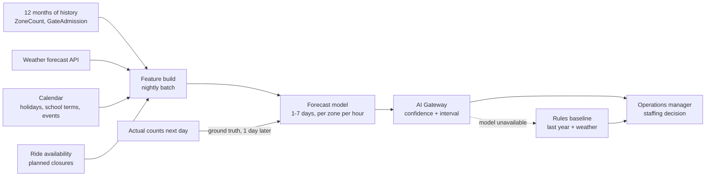

# cap-03: Visitor flow forecasting

Requirement FR-13. Objective O1 (attendance through queue reduction), O2 indirectly.
Ships in Phase 3, month 15 at the earliest. Type: time-series forecasting with exogenous
features.

## Why a rule is not enough

The rule is real and it ships first: **last year, same weekday, same week of season,
adjusted for the weather forecast.** It is the fallback, it is the year-one product, and
it is what the model must beat.

Where it fails:

| Case the rule misses | Why |
| --- | --- |
| The estate is growing from 5,000 to 15,000 a day (F6, F7) | "Last year" is a level that is systematically wrong when the level itself is changing. The rule needs a growth adjustment that someone has to guess. |
| Per-zone and per-hour distribution | Total attendance is one number. Where people are at 14:00 depends on the weather that morning, which rides are open, and what happened at the entrance at 11:00. The rule has no mechanism for redistribution. |
| Interactions | Hot weather plus a school holiday plus a closed shaded ride is not the sum of the three effects. |
| A new attraction or a changed layout | No last-year equivalent exists. |

So the case for a model is specifically: **level, distribution and interaction.** If the
estate were stable and the only question were total attendance, we would ship the rule and
stop, and the phase exit criterion is written so that this remains a possible outcome.

## Design

Legend: the dotted line is the automatic fallback path, which is exercised monthly. Ground
truth arrives the next day, which makes this the only capability in the portfolio with fast,
cheap, unambiguous feedback.

| Element | Choice | Reason |
| --- | --- | --- |
| Model | Standard gradient-boosted or additive time-series model with exogenous regressors | Two days of work with a well-understood library, interpretable residuals, and no GPU. See [../03-delivery/build-vs-buy.md](../03-delivery/build-vs-buy.md). |
| Granularity | Per zone, per hour, 1-7 days ahead | Matches the staffing decision. Forecasting per minute would be precision nobody can act on. |
| Placement | Cloud, one nightly batch run | 60 EUR/month, fixed, independent of attendance ([cost model](../03-delivery/cost-model.md)) |
| Output | Point forecast plus a prediction interval, per zone per hour | The operations manager staffs against the upper bound at peak and the point estimate off-peak. An interval is what makes the forecast actionable rather than merely interesting. |

## Data

| Aspect | Detail |
| --- | --- |
| Training data | `ZoneCount` and `GateAdmission` events from Phase 0 go-live onward. 12 months minimum, covering a full season and a holiday period. |
| Exogenous | Weather forecast (bought, 40 EUR/month), calendar of holidays and school terms, planned ride closures, ticket pre-bookings from U2 |
| Pre-bookings deserve a note | The pre-booked share is a leading indicator the rule cannot use and the model can. By Phase 3 it is expected to be 40-60% of tickets (assumption), which makes it the single most valuable feature. |
| Holdout | Time-based: the final 3 months. Never a random split, which would leak the future into the past. |
| Cold start | 12 months from Phase 0 go-live at month 3, so month 15. This drives the whole phase sequence. ADR-0013. |

## Uncertainty

| Source | Handling |
| --- | --- |
| The estate is changing while the model learns | Recent history is weighted more heavily, and the model is retrained quarterly rather than annually. We expect its advantage over the rule to be largest in stable periods and smallest right after a step change, and we say so to the operations manager rather than presenting a flat accuracy number. |
| Weather forecasts are themselves uncertain | Prediction intervals widen with horizon. A 7-day forecast is explicitly presented as a planning aid, and a 1-day forecast as a staffing input. |
| One-off events (a local festival, a road closure) | Cannot be learned from 12 months of history. The operations manager can enter a known event as an override; the model does not attempt to discover them. |
| Over-trust | The largest human risk here. Mitigation: the interval is always shown, the rules baseline is always shown alongside, and the phase exit criterion asks the operations manager to state in writing whether they trusted it, which surfaces over-trust and under-trust equally. |

## Validation and verification

| Stage | Criterion |
| --- | --- |
| Offline gate | Beats the rules baseline on MAPE by >= 20% relative, on the time-based holdout, at both the daily and the hourly horizon |
| Interval calibration | The 80% prediction interval contains the actual value 75-85% of the time on the holdout. An overconfident interval is worse than a wide one. |
| Beat the fallback | Explicit and hard. If it does not beat the rule, the rule ships as the product and the phase exit criterion becomes "the baseline is in daily use". |
| Shadow | 6 weeks in production alongside the baseline, both visible to the delivery team, only the baseline visible to operations |
| Adoption gate | The operations manager staffs from the forecast for 6 consecutive weeks and reports acting on it in at least 4. A forecast nobody uses has no value regardless of its error. |
| Approver | Operations manager |
| Production monitoring | Daily MAPE against actuals, per zone and per horizon; interval coverage; drift in the feature distribution |
| Automatic rollback | Rolling 14-day MAPE worse than the rules baseline reverts to the baseline automatically, with an alert |

The automatic rollback here is unusually clean, because the fallback runs continuously in
parallel and both are scored against the same next-day truth. Where a capability allows a
cheap champion-challenger comparison, we use it; where it does not (welfare, offers), we
say so and rely on human adjudication instead.

## Degradation ladder

| Level | State | Behaviour |
| --- | --- | --- |
| 0 | Working | Model forecast with interval, baseline shown alongside |
| 1 | Model worse than baseline over 14 days | Automatic revert to baseline; retraining ticket |
| 2 | Weather feed unavailable | Model runs without the weather feature, interval widens automatically |
| 3 | Model unavailable | Rules baseline |
| 4 | No history (year one) | Hand-built calendar model from the operations manager's expectations, replaced by the rule as soon as one year exists |

## Alternatives considered

| Alternative | Why not |
| --- | --- |
| Ship a model in year one on 4 months of data | It would have no seasonal signal at all and would be presented as a forecast. That is the exact failure the cold-start policy (ADR-0013) exists to prevent, and it would break the "beat the fallback" gate anyway. |
| Buy a forecasting SaaS | Costs more than the model is worth, hides the residuals we need to audit, and adds a vendor to a system a 2-person team must own. |
| Deep learning sequence model | 12 months of hourly data is a small dataset. The gain over a well-specified additive model would be within the noise, and the interpretability loss is real: the operations manager needs to see why. |
| Real-time within-day nowcasting | Genuinely useful for queue management, and deliberately deferred: it needs an operational response capability (moving staff within the hour) that the estate does not have yet. Adding a forecast nobody can act on is the mistake this whole document is written against. |
| Forecast-driven dynamic pricing | Different decision, different failure mode, rejected on suitability. [../05-process/decision-log.md](../05-process/decision-log.md) D5. |
