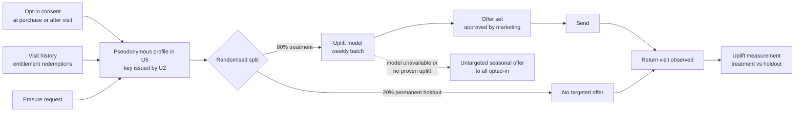

# cap-04: Return-visit and pass-upgrade offers

Requirement FR-14, FR-16. Objective O3 (repeat visit rate, pass share). Ships in Phase 4,
month 24 at the earliest. Type: uplift modelling on an opted-in population.

This is the only capability that touches personal data, and the only one that can be
cancelled by its own exit criterion. Both are deliberate.

## Why a rule is not enough

The rule ships first and may well win: **send every opted-in pass holder a seasonal
renewal offer, and every opted-in single-ticket visitor one family-pass offer.** It is
untargeted, it is cheap, and it is the fallback.

Where it fails:

| Case the rule misses | Why |
| --- | --- |
| Offering a discount to someone who was going to return anyway | The offer costs margin and buys nothing. Untargeted campaigns spend most of their budget on this group. |
| Not offering to someone who is persuadable | Invisible to a rule, because the rule has no notion of persuadability. |
| Annoying people who will never return | Contact fatigue reduces the value of every later contact, and for a family audience it is a trust cost. |

The distinction between "will return" and "will return *because we contacted them*" is
precisely what a propensity rule cannot express and an uplift model can. That is the entire
case for this capability, and it is a narrow one, which is why it is last.

## Design

Legend: the holdout group is permanent and never receives targeted offers. The dotted line
is the fallback. Erasure removes the profile entirely, and because personal data lives only
in U5, that is a single-unit operation.

| Element | Choice | Reason |
| --- | --- | --- |
| Population | Opted-in visitors only | ADR-0009. No inference on non-consenting visitors, ever. |
| Identity | Pseudonymous key issued by U2, holding no name or contact details itself | Contact details stay in the consent record; the model never sees them. Erasure breaks the key. |
| Model | Two-model uplift or a single model with a treatment interaction term | Small data, interpretable, retrainable in minutes |
| Placement | Cloud, weekly batch | 50 EUR/month, fixed ([cost model](../03-delivery/cost-model.md)) |
| Offer set | Written and approved by a human, always | The model chooses who sees which existing offer. It never invents an offer, a discount level or a message. |
| Holdout | Permanent, >= 20% | It is the only way to know whether this capability is worth its existence, and it is cheap. |

## Data

| Aspect | Detail |
| --- | --- |
| Training data | Visit history and offer-response history of opted-in visitors |
| Features | Visit count and recency, entitlement type, party size, zones visited (from anonymous counts joined only at the entitlement level, not by tracking), season of visit, previous offer responses |
| What is deliberately absent | Location traces, dwell time per individual, purchase-level detail beyond the entitlement, any third-party data. See the exclusion list in [../00-problem/requirements.md](../00-problem/requirements.md). |
| Labels | Return visit within a defined window, observed at the gate |
| Cold start | Requires a cohort observed across two visits and, per the Phase 4 dependency, at least 2,000 consenting holders (assumption). Below that, the uplift measurement has no statistical power and the capability ships as a rules-based segment offer instead. |

## Uncertainty

| Source | Handling |
| --- | --- |
| Uplift is a difference of small numbers, so the confidence interval is wide | Do not act on a difference that is inside the interval. The exit criterion requires significance across two comparison periods, not one. |
| Selection bias: opted-in visitors are not typical visitors | The model is only ever applied to opted-in visitors, so the bias is inside the population it serves. We do not extrapolate to anyone else. |
| Seasonality confounds the measurement | Treatment and holdout are randomised within the same period, which removes it by construction. |
| Fairness | A model that systematically excludes a group from discounts is a fairness problem even with pseudonymous data. Checked by comparing offer rates across entitlement types and party sizes; a large unexplained gap blocks promotion. |
| The capability may simply not work | Explicitly allowed. Exit criterion (1) switches it off if uplift is not demonstrated. This is written down in advance, when it is still cheap to agree to. |

## Validation and verification

| Stage | Criterion |
| --- | --- |
| Offline gate | The uplift model beats a propensity baseline on a historical holdout, on the standard uplift ranking measure |
| Live gate | Statistically significant uplift in return visits over the permanent holdout, across 2 comparison periods |
| Fairness check | Offer rate differences across entitlement type and party size within a stated tolerance |
| Privacy gate | [FF-11](../04-verification/fitness-functions.md#ff-11): no personal record without a consent reference; erasure demonstrated end to end including backups |
| Approver | Operations manager plus the owner, because this one is visible to visitors |
| Production monitoring | Uplift against holdout, opt-out rate, complaint rate, offer fatigue (contacts per person per season, capped) |
| Automatic rollback | Rising opt-out rate or no measurable uplift over 2 periods reverts to the untargeted fallback |

Uplift cannot be validated offline in any way that predicts the live result. That is a
property of the problem, not a gap in our method, and it is why the holdout is permanent
rather than a launch experiment.

## Degradation ladder

| Level | State | Behaviour |
| --- | --- | --- |
| 0 | Working, uplift proven | Targeted offers to the treatment group |
| 1 | Model unavailable | Untargeted seasonal offer to all opted-in holders |
| 2 | No proven uplift after 2 periods | Capability switched off; untargeted offers continue; the decision and its evidence are recorded |
| 3 | Consent system unavailable | No offers sent at all. Sending without a verified consent record is not a degraded mode; it is a breach. |

Level 3 is the one worth stating: for every other capability, degradation means doing
something simpler. Here it means doing nothing.

## Alternatives considered

| Alternative | Why not |
| --- | --- |
| Propensity model ("who is likely to return") | Targets the people who need no persuasion. It optimises a metric that looks good and spends margin on visitors who were coming anyway. |
| Personalised dynamic pricing | Rejected; see [../05-process/decision-log.md](../05-process/decision-log.md) D5. |
| RFID wristbands to build a richer behavioural profile | Rejected by ADR-0009. It would improve this model and it would cost the estate its "we do not track you" position with a family audience, for a capability whose measured value is not yet established. Wrong trade, and the trade is why we deferred this capability to last. |
| Buying third-party audience data | Rejected on privacy and on quality. |
| A generative model writing personalised offer copy | Adds an unverifiable output to a visitor-facing channel with a brand risk, in exchange for wording variation. The offer set is small, written once and reviewed. |
| Skipping this capability entirely | A legitimate outcome. It is last in the plan precisely so that it can be dropped without harming anything else, and the Phase 3 transition signal already tests whether it is worth starting. |
