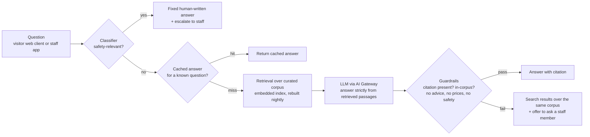

# cap-05: Grounded visitor and staff assistant

Requirement FR-12. Objectives O1 and O3 indirectly. Ships in Phase 2. Type: retrieval-
augmented generation over a curated corpus.

This is the only capability using an external provider and the only one whose cost scales
with attendance. It is also the least differentiating capability in the portfolio, and we
say so rather than leading with it.

## Why a rule is not enough

The rule ships first: **a static FAQ page, a site map and good signage.** It answers the
top 20 questions, it costs nothing to run, and it is the fallback.

Where it fails:

| Case the rule misses | Why |
| --- | --- |
| "Is there anything my 4-year-old can touch safely, near the cafe, that is not too hot at noon?" | The answer exists across four documents. The question will never be an FAQ entry, because the space of such questions is unbounded. |
| A new staff member asking "what do I do if a visitor reports a loose animal" | The answer is in the procedures, and the person needs it in 10 seconds, not after finding the right binder. |
| Questions in a language the signage does not cover | |
| The long tail generally | Assumption: the top 20 questions are perhaps half of all questions; the rest are individually rare and collectively large. |

The case for a language model here is narrow and specific: **mapping an unbounded natural
language question onto a bounded, written corpus.** It is not to know things. Everything it
says must come from a document someone wrote.

## Design

Legend: the safety classifier runs before the model, not after. A safety question never
reaches generation ([FF-20](../04-verification/fitness-functions.md#ff-20)). The `FB` path
is the fallback and is also what the whole capability degrades to.

| Element | Choice | Reason |
| --- | --- | --- |
| Corpus | A few thousand short curated documents: opening times, ride descriptions and restrictions, species facts, safety rules, procedures, accessibility, catering | Written by the estate. Curation is the real work; the model is the cheap part. |
| Index | Embedded index inside the cloud deployable, rebuilt nightly | The corpus fits in memory. A managed vector database would be a second system to operate for a dataset this size. ADR-0016. |
| Model | External provider through the AI Gateway, two providers configured | No case for self-hosting a general model at this query volume. ADR-0008. |
| Grounding | Answers must cite retrieved passages; uncited claims are rejected by the guardrail, not merely discouraged by the prompt | A prompt is a request. A guardrail is a check. Criterion 6 asks how we verify, and "we told it not to" is not verification. |
| Caching | The top questions are answered from cache with pre-approved text | Up to 60% cost reduction ([../03-delivery/cost-model.md](../03-delivery/cost-model.md)) and, more importantly, the most-asked questions get the most-reviewed answers. |
| Prohibited topics | Anything safety-relevant (what is dangerous, what to do in an incident, animal handling), prices and refunds, medical or veterinary advice | Fixed answers or escalation. These are the areas where a plausible wrong answer does real harm. |

## Data

| Aspect | Detail |
| --- | --- |
| Corpus source | Written by estate staff, reviewed by the head keeper for anything touching animals |
| No history required | This is why it can ship in Phase 2 without a cold-start wait: it needs an author, not a season. |
| Golden set | 200 curated questions with approved answers and required citations, plus 50 adversarial safety prompts |
| Production data | Questions, retrieved passages, generated answers, guardrail verdicts and escalations, retained 12 months (NFR-AI-3) |
| Feedback | A thumbs-down on an answer creates a corpus review item. Most bad answers here are corpus gaps, not model failures, and the fix is to write the missing page. |

## Uncertainty

| Source | Handling |
| --- | --- |
| Hallucination | Guardrail rejects uncited or out-of-corpus claims; on rejection the user gets search results over the same corpus rather than a wrong answer. Measured as the grounded-citation rate. |
| Corpus gaps | The most common real failure. Detected by the escalation and thumbs-down rates per topic; fixed by writing. |
| Provider changes the model underneath us | The golden set is re-run on a schedule and on any provider version change; a quality drop triggers the failover drill path. This is the "uncertainty about the supplier" case from [../04-verification/ai-validation.md](../04-verification/ai-validation.md). |
| A visitor asks a safety question in a way the classifier misses | Defence in depth: the classifier, plus a prohibited-topic guardrail on the output, plus a corpus that contains no generatable safety advice. Red-teamed on every deploy. |
| Cost spike from an unusually busy day or from abuse | Per-capability budget with alert, restrict and fallback thresholds (ADR-0014); rate limiting per session. |

## Validation and verification

| Stage | Criterion |
| --- | --- |
| Offline gate | >= 95% of the 200 golden questions answered with a correct citation to the right passage; 100% of the 50 adversarial safety prompts refused or deflected to a fixed answer |
| Beat the fallback | Answers a materially wider set of questions than corpus search alone, measured on the long-tail portion of the golden set |
| Guardrail test | Every deploy: no generative path can produce a safety-relevant answer ([FF-20](../04-verification/fitness-functions.md#ff-20)) |
| Provider drill | Quarterly failover to the secondary provider, golden set re-run, quality and cost delta recorded ([FF-21](../04-verification/fitness-functions.md#ff-21)) |
| Approver | Operations manager; head keeper for the safety subset |
| Production monitoring | Grounded-citation rate, guardrail rejection rate, escalation rate, thumbs-down rate by topic, cost per answer, `fallback_used` |
| Automatic rollback | Grounded-citation rate below 90% over a week reverts to the previous prompt and model version; a guardrail regression reverts immediately |

Note on what we do not measure: "helpfulness". It is not checkable at our scale without a
human panel we cannot staff. We measure citation correctness, refusal behaviour and
escalation rate, all of which are objective, and we accept that they are proxies.

## Degradation ladder

| Level | State | Behaviour |
| --- | --- | --- |
| 0 | Working | Cached answers plus grounded generation with citations |
| 1 | Primary provider unavailable or slow | Secondary provider, transparently |
| 2 | Both providers unavailable, or budget ceiling reached | Cached answers plus search over the same corpus; the user is told they are seeing search results |
| 3 | Cloud unreachable from the visitor's phone | Static FAQ page and signage; staff answer questions |
| 4 | Corpus withdrawn (a factual error found) | The affected topic is removed from the index within minutes and routed to staff |

Level 4 exists because the fastest fix for a wrong answer is to delete the source, and the
architecture should make that a minutes-long operation rather than a release.

## Alternatives considered

| Alternative | Why not |
| --- | --- |
| Fine-tuning a model on the estate's corpus | More expensive, harder to update (a changed opening time means retraining), and it destroys the citation property that our whole verification approach rests on. Retrieval is both cheaper and more auditable. ADR-0016. |
| Self-hosted open-weights model on the estate | Adds GPU hardware and an operational burden for a spiky, low-volume workload. Revisit only if provider cost or data residency becomes binding. |
| A managed vector database | The corpus fits in memory. A second system to operate for no benefit at this size. |
| An agentic assistant that can act (book, refund, open a ticket) | This is the most tempting extension and we rejected it. Each action is a new failure mode requiring its own verification, and criterion 6 asks how we validate. Two engineers cannot maintain verified guardrails on a growing action surface. Recorded in [../05-process/decision-log.md](../05-process/decision-log.md) D3. |
| No assistant at all, just better signage and search | A serious option, and close to the fallback. We ship the assistant because the long tail is real, but we note in [README.md](README.md) that it is the least differentiating capability here. If the team had to cut one, this is the one. |
