# Implementation plan

This is the central artifact of this submission. The claim it defends: **an architecture
that the client's team cannot build and operate is not an architecture.** Every phase
below states what ships, what it closes, what it costs, who builds it, and a exit
criterion written as a condition someone can run and observe.

All money and duration figures are `(assumption)`; their basis is in
[cost-model.md](cost-model.md). Attendance figures 5,000 and 15,000 are facts F6 and F7.

## Shape of the plan

```mermaid
gantt
  title Delivery phases (months from start)
  dateFormat X
  axisFormat %s
  section Foundation
  P0 Sell, admit, count (no AI)      :p0, 0, 3
  section Sensing
  P1 Welfare sensing and rules       :p1, 3, 6
  section First models
  P2 Welfare anomaly and assistant   :p2, 9, 6
  section Forecasting
  P3 Demand forecasting              :p3, 15, 9
  section Retention
  P4 Opt-in offers                   :p4, 24, 12
```

Legend: the horizontal axis is months from project start. Bars are elapsed calendar time,
not effort. Phases overlap only in their final and first two weeks (handover of a live
system to its operators).

| Phase | Months | Theme | AI in this phase |
| --- | --- | --- | --- |
| 0 | 0-3 | Sell, admit, count | None, by design |
| 1 | 3-9 | Sense the animals, alert by rule | One CV capability, late in the phase |
| 2 | 9-15 | Learn from a season of data | Two capabilities |
| 3 | 15-24 | Forecast demand | One capability, gated on 12 months of history |
| 4 | 24-36 | Bring visitors back | One capability, opt-in only |

The cold-start arithmetic that sets this sequence is at the bottom of this page.

---

## Phase 0: Sell, admit, count

**Months 0-3. No models. This phase must be worth paying for on its own.**

| Field | Value |
| --- | --- |
| Ships to production | Online and gate ticket sales (FR-1), family passes (FR-2), offline-authoritative gate validation (FR-3) and reconciliation (FR-4), zone counting (FR-5), ride status board (FR-6), a one-page commercial report (FR-15 basic). 6 edge nodes, 8 gate terminals, 12 counting sensors. |
| Requirements closed | FR-1, FR-2, FR-3, FR-4, FR-5, FR-6, FR-15 (basic). NFR-AVAIL-1, NFR-AVAIL-2, NFR-PERF-1, NFR-SCALE-1, NFR-DATA-1, NFR-SEC-1, NFR-SEC-2, NFR-PRV-1, NFR-OPS-2, NFR-USE-1. |
| Metric moved | Pre-booked share of tickets from 0 to 40% (assumption); peak entries per gate to 500/hour (assumption); and, most importantly, **every metric in [../00-problem/okrs.md](../00-problem/okrs.md) that reads `unknown` today gets a value.** |
| Team | 4 people, 3.5 FTE: 1 lead engineer, 2 engineers, 1 field technician at 0.5. Client side: operations manager at 0.5 FTE, gate staff for acceptance testing. Full breakdown in [team-and-operating-model.md](team-and-operating-model.md). |
| CapEx delta | 28,000 EUR (assumption) |
| OpEx delta | +1,030 EUR/month (assumption) |
| Depends on | A2 (entrance count) and A4 (no legacy ticketing) confirmed in weeks 1-2. Nothing else. |
| **Exit criterion** | All four conditions hold in a witnessed test on the live estate: (1) with the cellular uplink physically disconnected for 72 hours, 6 gates validate entitlements and admit visitors, and the local redemption logs replay on reconnect with a conflict rate below 0.5%; (2) a load test sustains 3,000 scans/hour across the gate fleet with p95 scan-to-decision under 500 ms measured on the terminal; (3) zone counts for one full operating day match a manual audit of two zones within 2%; (4) a gate terminal and an edge node are each restored from cold by a member of gate staff, using only the printed runbook, in under 30 minutes. |
| **Signal to move to Phase 1** | The exit criterion holds, and 30 consecutive days of clean telemetry are in the analytics store. The second half matters more than the first: Phase 2's models are trained on this data, and a month of it is the first evidence that the pipeline produces trainable records rather than plausible-looking noise. |
| Not doing in this phase, and why | No enclosure sensing (a keeper-facing rollout needs the keepers' full attention and they are busy with the season opening). No models of any kind (there is no data yet and no baseline to beat, so any model would be unverifiable). No mobile app (A13). No personalization (ADR-0009). No dynamic pricing (see [../05-process/decision-log.md](../05-process/decision-log.md) D5). |

---

## Phase 1: Sense the animals, alert by rule

**Months 3-9. One AI capability, and it is the one that needs weeks of data, not a year.**

| Field | Value |
| --- | --- |
| Ships to production | Enclosure sensing across 55 enclosures (FR-7), feeding schedule and adherence tracking (FR-8), rule-based welfare alerting to keepers (FR-10, rules only), operational task dispatch that works offline (FR-11), and piranha population estimation by computer vision (FR-9, [cap-02](../02-ai-capabilities/cap-02-piranha-population.md)) from month 7. |
| Requirements closed | FR-7, FR-8, FR-9, FR-10 (rules), FR-11. NFR-PERF-2, NFR-SCALE-2, NFR-SAFE-1, NFR-AI-1, NFR-AI-3 (first use). |
| Metric moved | Keeper hours on routine checks -25% (assumption). Piranha population goes from "no estimate exists" to an estimate with a stated interval. Welfare incident baseline established, which is the precondition for the O4 target. |
| Team | 5.5 FTE: Phase 0 team plus 1 data engineer and a half-time ML engineer; field technician full time during the sensor rollout (months 3-5). Client side: head keeper at 0.3 FTE for threshold definition and alert triage design. |
| CapEx delta | 50,000 EUR (assumption), of which 26,400 is 240 welfare sensors and 3,500 is one edge GPU node for tank cameras |
| OpEx delta | +540 EUR/month (assumption), of which about 80 is model inference |
| Depends on | Phase 0 edge fleet and event backbone in production. Head keeper's availability to set thresholds (this is the real critical path, not the hardware). A11 (tanks are camera-observable) confirmed before ordering cameras. |
| **Exit criterion** | (1) For 30 consecutive days, every enclosure reports at least 95% of expected readings, and each gap longer than 1 hour has a recorded cause; (2) an injected threshold breach in a test enclosure reaches a keeper's device in under 60 seconds **with the uplink disabled**, repeated across all 6 edge nodes; (3) the head keeper signs off that the alert rate is workable, defined as fewer than 3 non-actionable alerts per keeper per day averaged over 2 weeks; (4) the piranha estimate for two tanks falls within 10% of a witnessed manual count, on two separate occasions a month apart. |
| **Signal to move to Phase 2** | Six months of enclosure telemetry exists, and the incident log contains at least 20 recorded welfare events with outcomes. Twenty is not a statistical threshold, it is a feasibility threshold: below it there is nothing to build a golden set from, and [cap-01](../02-ai-capabilities/cap-01-animal-welfare-anomaly.md) cannot be evaluated, only deployed on faith. If the count is below 20 at month 9, Phase 2 starts with the assistant only and welfare anomaly detection waits. |
| Not doing in this phase, and why | No anomaly model (the golden set does not exist yet; see the signal above). No visitor-facing AI (the keepers' rollout owns the team's attention). No thermal cameras (RGB plus environmental sensors have not yet been shown to be insufficient; adding thermal before that is buying a solution to an unmeasured problem). |

---

## Phase 2: Learn from a season of data

**Months 9-15. The first models that learn from estate history.**

| Field | Value |
| --- | --- |
| Ships to production | Welfare anomaly detection as an enrichment layer over the existing rules (FR-10, [cap-01](../02-ai-capabilities/cap-01-animal-welfare-anomaly.md)); the grounded visitor assistant (FR-12, [cap-05](../02-ai-capabilities/cap-05-guest-companion.md)); the model registry, evaluation harness and gateway from [../01-architecture/ai-platform.md](../01-architecture/ai-platform.md) as production components. |
| Requirements closed | FR-10 (model), FR-12. NFR-AI-2, NFR-AI-4, NFR-AI-5, NFR-MOD-1. |
| Metric moved | Unflagged welfare incidents -30% against the Phase 1 baseline (assumption). Assistant deflects a measurable share of repeated staff questions (assumption: 40% of the top 20 question types). |
| Team | 5.5 FTE: the ML engineer contract goes to full time while the field technician steps back to half. Together with Phase 1 this is the 12-month headcount peak, and it is temporary by design: the steady-state operating team is 2.25 FTE (NFR-OPS-1). |
| CapEx delta | 5,000 EUR (assumption), training compute and a labelling workstation |
| OpEx delta | +630 EUR/month (assumption), of which 330 is AI: 210 assistant inference plus 120 welfare model compute |
| Depends on | Phase 1 exit signal (>= 20 labelled welfare events, 6 months of telemetry). A6 (a vet is reachable) still holding; if not, see the playbook below. |
| **Exit criterion** | (1) The welfare anomaly model passes its offline gate on a held-out golden set (recall >= 0.90 on events the keepers marked as genuine, precision >= 0.60, calibration error <= 0.05) and then runs 4 weeks in shadow with its outputs invisible to keepers; (2) in shadow it flags at least 3 events the rules missed, each confirmed by the head keeper as genuine, and produces no more than 3 additional alerts per keeper per day at the chosen threshold; (3) the assistant answers 200 golden questions with a grounded-citation rate above 95% and zero safety-relevant answers produced by generation rather than by a fixed rule ([FF-20](../04-verification/fitness-functions.md#ff-20)); (4) a rehearsed provider failover moves assistant traffic to the secondary provider inside one working day with the quality delta recorded. |
| **Signal to move to Phase 3** | Twelve months of continuous attendance and zone-count history is available (this arrives at month 15, counted from the Phase 0 go-live at month 3), and it includes at least one full high season and one holiday period. Without both, a forecasting model has no seasonal signal to learn and the honest choice is to keep the rules baseline. |
| Not doing in this phase, and why | No forecasting (the history does not exist yet, see ADR-0013). No personalization or offers (no opt-in mechanism, and no reason to build one until there is something worth offering). No autonomy or agentic behaviour ([../05-process/decision-log.md](../05-process/decision-log.md) D3). |

---

## Phase 3: Forecast demand

**Months 15-24. The first capability that changes how the estate is staffed.**

| Field | Value |
| --- | --- |
| Ships to production | Visitor volume forecasting per zone per hour, 1 to 7 days ahead (FR-13, [cap-03](../02-ai-capabilities/cap-03-visitor-flow-forecast.md)); staffing and opening recommendations derived from it; full commercial reporting (FR-15 complete). |
| Requirements closed | FR-13, FR-15 (complete). |
| Metric moved | Attendance toward 15,000/day via queue reduction at peak; overtime hours down (assumption -20%); revenue per visitor up through better placement of food and retail against measured flow. |
| Team | 4.75 FTE: ML engineer contract reduced to half time; one engineer transitions to the client's payroll as the future operator. Knowledge transfer is a deliverable of this phase, not an afterthought. |
| CapEx delta | 3,000 EUR (assumption) |
| OpEx delta | +330 EUR/month (assumption), of which 60 is forecasting inference and 40 the weather feed |
| Depends on | 12 months of clean attendance history, confirmed by the Phase 2 exit signal. Weather data feed (a cheap external API, assumption 40 EUR/month). |
| **Exit criterion** | (1) On a held-out final 3 months, the model beats the rules baseline (last-year-same-weekday plus weather adjustment) on mean absolute percentage error by at least 20% relative, at both the daily and the hourly horizon; (2) the operations manager runs staffing from the forecast for 6 consecutive weeks and reports, in writing, that they trusted it enough to act on it at least 4 of those weeks; (3) forecast failures degrade to the rules baseline automatically, demonstrated by disabling the model mid-week with no operational interruption ([FF-16](../04-verification/fitness-functions.md#ff-16)). |
| **Signal to move to Phase 4** | Attendance is on a trajectory that reaches 15,000 (assumption: above 11,000/day season average at month 24), and the client has an identifiable base of repeat visitors and pass holders large enough that targeting them is worth the privacy cost. If attendance is not on trajectory, Phase 4 is the wrong answer, and the plan says so: the money goes into physical capacity and content, not into a recommendation model. |
| Not doing in this phase, and why | No dynamic pricing. Forecasting demand and pricing against demand are different decisions with different failure modes, and the second one damages trust with families ([../05-process/decision-log.md](../05-process/decision-log.md) D5). |

---

## Phase 4: Bring visitors back

**Months 24-36. The only phase that touches personal data, and it is opt-in.**

| Field | Value |
| --- | --- |
| Ships to production | Opt-in consent and erasure flows (FR-16), next-visit and pass-upgrade recommendations (FR-14, [cap-04](../02-ai-capabilities/cap-04-return-visit-offers.md)) with a permanent holdout group. |
| Requirements closed | FR-14, FR-16. NFR-PRV-2 (fully exercised). |
| Metric moved | Repeat visit rate 12% to 25% (assumption); family-pass share of revenue to 30% (assumption). |
| Team | 3.5 FTE, of which 2 are now the client's own staff. External involvement ends at month 36. |
| CapEx delta | 0 |
| OpEx delta | +170 EUR/month (assumption), of which 50 is the offers model |
| Depends on | Phase 3 signal. An opt-in base large enough to evaluate: at least 2,000 consenting holders (assumption), otherwise the uplift measurement has no power and the capability ships as a rules-based segment offer instead. |
| **Exit criterion** | (1) A randomised holdout of at least 20% shows a statistically significant uplift in return visits over 2 comparison periods, or the capability is switched off; (2) an erasure request removes all personal data within 30 days, demonstrated end-to-end including backups and the analytics store ([FF-11](../04-verification/fitness-functions.md#ff-11)); (3) opt-out is one action and takes effect within one hour. |
| **Signal that the programme is complete** | The client's own team has operated the full system through one season with no external on-call, and the fitness function dashboard has been green for 3 consecutive months. |
| Not doing, ever, without a new decision | Biometric identification, location tracking of individuals, or purchase of third-party visitor data. These are excluded by ADR-0009, not deferred. |

---

## What breaks if a phase is skipped

| Skipped | What breaks | Why it is not recoverable by working harder later |
| --- | --- | --- |
| Phase 0 | There is no ticket data, no attendance baseline and no event backbone. Every later phase loses its input and its measuring stick. | Models in Phases 2-4 are trained on Phase 0-1 history. History cannot be created retroactively; this is the single hardest dependency in the plan. |
| Phase 1 sensing | The welfare anomaly model has no features and no labels. The piranha requirement (FR-9, from F9) is simply unmet. | You can buy sensors in a week and you cannot buy six months of readings at any price. |
| Phase 1 rules layer, going straight to a model | The safety path would depend on a model, violating NFR-SAFE-1, and there would be no deterministic fallback to degrade to (NFR-AI-1). | The rules are not scaffolding for the model; they are the permanent floor beneath it. Removing them removes the reason the model is allowed to be uncertain. |
| Phase 2 shadow period | A model would go live without evidence, breaking NFR-AI-2, and keeper trust would be spent on a guess. | Keeper trust is spent once. An early false-alarm storm makes every later alert ignorable, and no retraining fixes a human who has stopped reading the notifications. |
| Phase 3 | The estate keeps staffing by intuition. Attendance growth stalls at whatever the gates and queues allow. | Recoverable, but each missed season is a third of the runway in F7. |
| Phase 4 | Return rate stays at its organic level; O3 is missed. | Recoverable and the least damaging omission. This is why it is last. |

## When an assumption fails

Each row is a rehearsed response, not a replan.

| Failure | Immediate effect | Response | Cost of the response |
| --- | --- | --- | --- |
| **No veterinarian available** (A6 fails) | [cap-01](../02-ai-capabilities/cap-01-animal-welfare-anomaly.md) loses the human who acts on middle-confidence alerts, and the ground-truth source (treatment records) disappears. | Narrow the capability: keep Phase 1 rule-based threshold alerts to keepers, cancel the Phase 2 anomaly model, and put a written external escalation contract in its place. Reassign the ML engineer contract to the assistant. | Phase 2 loses half its scope. Saves about 30,000 EUR (assumption). O4 target reduced from -60% to -30%. |
| **No usable cellular coverage** (A5 fails) | The uplink becomes satellite or scheduled. Reporting freshness drops from minutes to hours. | No design change. Store-and-forward already assumes disconnection; we increase local retention from 72 hours to 7 days (a disk size change) and move the reconciliation cadence to daily. If even that fails, the cloud modules move onto an on-estate server, per [style-decision.md](../01-architecture/style-decision.md). | +200 EUR/month for satellite (assumption), or a one-off 12,000 EUR for on-estate hosting plus the loss of managed backups. |
| **Team is 2 people, not 4-6** (A7 fails) | Phase 0 stretches from 12 to about 20 weeks; Phases 3 and 4 become unaffordable. | Cut in this order: Phase 4 entirely, then Phase 3's model (keep the rules baseline), then the assistant. Never cut the Phase 1 rules layer or the Phase 0 gate work. Buy a hosted analytics product instead of building the U5 reporting surface. | The estate keeps everything that closes a brief requirement and loses the capabilities that improve margins. |
| **Twelve months of history never materialises** (A9 holds harder than expected, for example a season is lost) | [cap-03](../02-ai-capabilities/cap-03-visitor-flow-forecast.md) cannot be built. | Phase 3 ships the rules baseline as the permanent product, clearly labelled as such, and the phase's exit criterion becomes "the baseline is in daily use". The model waits for the next season. We do not ship a model trained on 4 months and call it a forecast. | One season of forecasting benefit lost. No sunk cost, because the baseline was going to be built anyway as the fallback (NFR-AI-1). |
| **A legacy ticketing system exists** (A4 fails) | FR-1 and FR-2 become integration rather than build. | Phase 0 grows by about 4 weeks; the gate work (FR-3, FR-4) is unchanged and remains the highest-value part. If the legacy system cannot export entitlements, we run the allow-list from a nightly extract and accept a one-day revocation lag. | +4 weeks, about 12,000 EUR (assumption). |
| **Piranha tanks are not camera-observable** (A11 fails) | FR-9 as designed is infeasible. | Fall back to a sampling protocol with a documented count procedure and a manual entry screen, which is what the estate does today, plus scheduled reminders. Reassign the GPU node to welfare video if useful, otherwise do not buy it. | Saves 8,300 EUR (assumption): 4,800 of cameras plus the 3,500 GPU node. FR-9 is met at lower quality, and we say so rather than pretending a model exists. |
| **Attendance is flat at month 24** | Phase 4's premise (a base of repeat visitors worth targeting) is false. | Stop the software programme at Phase 3 and report that further IT spend is not the constraint. This is the plan's own kill switch, and it is stated here so that it is a decision rather than a drift. | Saves 12 months of team cost. |

## The cold-start arithmetic

Three capabilities in the portfolio depend on history that does not exist at the start.
This is not a caveat; it sets the shape of the whole plan.

| Capability | Needs | First available | Earliest honest phase | What runs until then |
| --- | --- | --- | --- | --- |
| [cap-02](../02-ai-capabilities/cap-02-piranha-population.md) piranha counting | A few thousand labelled frames from the estate's own tanks | About 8 weeks after cameras are installed (month 5) | Phase 1, month 7 | Manual counts, as today |
| [cap-01](../02-ai-capabilities/cap-01-animal-welfare-anomaly.md) welfare anomaly | 6 months of enclosure telemetry plus >= 20 labelled events | Month 9 | Phase 2 | Deterministic thresholds set by the head keeper, which remain permanently |
| [cap-03](../02-ai-capabilities/cap-03-visitor-flow-forecast.md) demand forecast | 12 months of attendance covering a full season and a holiday period | Month 15 (Phase 0 go-live at month 3 plus 12) | Phase 3 | Last-year-same-weekday plus weather adjustment; in year 1, a hand-built calendar model |
| [cap-04](../02-ai-capabilities/cap-04-return-visit-offers.md) return-visit uplift | A cohort of opted-in visitors observed across two visits | Month 24+ | Phase 4 | Untargeted pass promotion |
| [cap-05](../02-ai-capabilities/cap-05-guest-companion.md) assistant | A curated document corpus, not history | As soon as someone writes the corpus | Phase 2 | Static FAQ page and signage |

The only capability with no history dependency is the assistant, because retrieval over a
written corpus needs an author rather than a season (ADR-0016). That is precisely why it
is the cheapest AI capability here and also the least differentiating; we say so in
[../02-ai-capabilities/README.md](../02-ai-capabilities/README.md) rather than presenting
it as the centrepiece.

## Related

- Week-by-week detail of Phase 0: [first-90-days.md](first-90-days.md)
- Who builds it: [team-and-operating-model.md](team-and-operating-model.md)
- What it costs: [cost-model.md](cost-model.md)
- How each exit criterion is measured: [../04-verification/fitness-functions.md](../04-verification/fitness-functions.md)
- Why the phase gate exists at all: ADR-0001; why models wait: ADR-0013.
