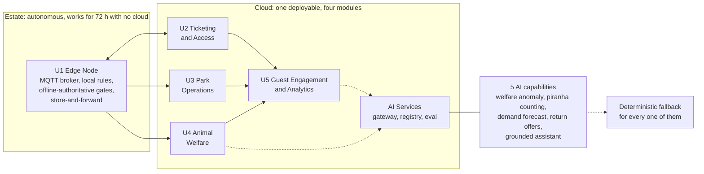

# Von Digitalis Estates - architecture submission

**Team:** _[NoNaMe]_
**Kata:** O'Reilly Architectural Katas 2026, AI-Assisted Software Architecture

> **Thesis:** an architecture the Countess's own small team cannot build, run and check is
> not an architecture, so this submission is organised around three things the design must
> survive: **a delivery plan with failable exit criteria, a verification contract for every
> requirement, and an honest record of how we used AI to design it.**

## The system in one diagram

Legend: dashed arrows are model calls; every one has a fallback (ADR-0012). The double
arrow survives disconnection by design (ADR-0003). Full diagrams in [diagrams/](diagrams/).

## Read this in five minutes

| Order | File | Why |
| --- | --- | --- |
| 1 | [03-delivery/implementation-plan.md](03-delivery/implementation-plan.md) | The centre of the submission. Five phases, each with an exit criterion someone can run and fail. Phase 0 ships no AI, on purpose. |
| 2 | [02-ai-capabilities/README.md](02-ai-capabilities/README.md) | Five capabilities, and the four we rejected because a rule is enough. The rejections are the more useful half. |
| 3 | [04-verification/fitness-functions.md](04-verification/fitness-functions.md) | 22 NFRs, 22 checks, no gaps. The answer to "how do you know". |
| 4 | [05-process/how-we-used-ai.md](05-process/how-we-used-ai.md) | How we used AI while designing this, including where it was wrong. |
| 5 | [01-architecture/decomposition.md](01-architecture/decomposition.md) | Five units, and why not thirteen. |

If you have one minute: the implementation plan's phase table, and the rejected-capability
table at the top of the portfolio page.

## How the six judging criteria are covered

| # | Criterion | Where it is answered | The short version |
| --- | --- | --- | --- |
| 1 | Innovative use of AI | [02-ai-capabilities/](02-ai-capabilities/), especially [cap-01](02-ai-capabilities/cap-01-animal-welfare-anomaly.md) and [cap-02](02-ai-capabilities/cap-02-piranha-population.md); plus [05-process/how-we-used-ai.md](05-process/how-we-used-ai.md) | Our innovation claim is narrow and deliberate: per-enclosure behavioural baselines for 55 mixed exotic enclosures, on-estate vision counting for a population nobody can currently count, and a documented AI-assisted design process kept as a rejection log while designing rather than reconstructed afterwards, which is the half of this kata's theme that submissions usually leave empty (ADR-0015). |
| 2 | Suitability under the constraints | [01-architecture/drivers-and-characteristics.md](01-architecture/drivers-and-characteristics.md), [03-delivery/team-and-operating-model.md](03-delivery/team-and-operating-model.md), [03-delivery/cost-model.md](03-delivery/cost-model.md), ADR-0002, ADR-0006 | Patchy Wi-Fi drives an edge-authoritative design. The cost model shows money is not the binding constraint; team capacity is, so the system is five units operable by two engineers. Four AI candidates were rejected because a rule is enough. |
| 3 | Appropriate level of detail | [01-architecture/decomposition.md](01-architecture/decomposition.md), [03-delivery/first-90-days.md](03-delivery/first-90-days.md), [01-architecture/core-platform.md](01-architecture/core-platform.md) | Detail is deep where a decision turns on it (the offline entitlement mechanism is specified, not named; Phase 0 is planned week by week) and absent where it would be speculation. Each core-platform and AI-platform page ends with what is deliberately absent, and why. |
| 4 | Dealing with uncertainty in AI | [04-verification/ai-validation.md](04-verification/ai-validation.md), ADR-0010, ADR-0012, ADR-0008, ADR-0013 | Four kinds are separated and answered differently: uncertainty about a case (confidence bands), about a model (evidence-sized claims and rules underneath), about a supplier (two providers, a quarterly drill with a measured switching cost), and about whether the capability was worth building (failable exit criteria and a permanent holdout). |
| 5 | Alignment of AI characteristics with the architecture | [01-architecture/drivers-and-characteristics.md](01-architecture/drivers-and-characteristics.md), [01-architecture/ai-platform.md](01-architecture/ai-platform.md), ADR-0012 | Stated as a constraint, not a feature: a capability inherits the availability requirement of the unit it lives in, and if it cannot meet it, it does not live there. Nothing at the edge calls a model on the critical path; generative AI is confined to the least available, least safety-relevant unit; a model failure is a business-hours P3, never a page. |
| 6 | Validation and verification of AI | [04-verification/](04-verification/), ADR-0007, ADR-0011 | Every NFR has one fitness function with a threshold and a breach action; the privacy, security, fallback and safety checks block the deploy. No model binds to production without a passed gate, and the registry enforces that mechanically rather than by policy. |

## What this submission contains

| Section | Contents |
| --- | --- |
| [00-problem/](00-problem/) | Brief facts as SSOT, what the brief does not say, stakeholders, requirements with sources and verification, OKRs, assumptions with impact analysis |
| [01-architecture/](01-architecture/) | Driving characteristics and what we accept being mediocre at, style comparison, five-unit decomposition, non-AI core platform, AI Services |
| [02-ai-capabilities/](02-ai-capabilities/) | Portfolio, four rejected candidates, and one file per accepted capability |
| [03-delivery/](03-delivery/) | Phased implementation plan, first 90 days, team and operating model, cost model, build-vs-buy |
| [04-verification/](04-verification/) | 22 fitness functions, AI validation and verification, test strategy for the non-AI system |
| [05-process/](05-process/) | How we used AI to design this; decision log including where we disagree with our teammates' variants |
| [06-adrs/](06-adrs/) | 16 ADRs with alternatives and a "how we will know this was right" check on each |
| [diagrams/](diagrams/) | Context, containers, deployment, three sequences, all with legends |
| [glossary.md](glossary.md) | Terms and identifier conventions |

## Ground rules we held ourselves to

| Rule | Consequence you can check |
| --- | --- |
| Every statement is a brief fact or is tagged `(assumption)`. | The only unmarked numbers are 5,000 and 15,000 visitors per day. |
| Every NFR has exactly one fitness function. | 22 and 22, checked mechanically. |
| Every AI proposal answers "why not a rule" before it answers anything else. | Four candidates were rejected on that question. |
| Every ADR ends with a check that could fail. | Sixteen "How we will know this was right" sections, each with a threshold and a revisit trigger. |
| No placeholders anywhere except in the process document, where a human must supply real examples rather than have us invent them. | Unfilled placeholders exist only in [05-process/how-we-used-ai.md](05-process/how-we-used-ai.md); ADR-0015 mentions the convention but contains none. |
| Every claim about cost states its basis and its sensitivity. | [03-delivery/cost-model.md](03-delivery/cost-model.md) names its weakest number and what breaks if it is wrong. |
