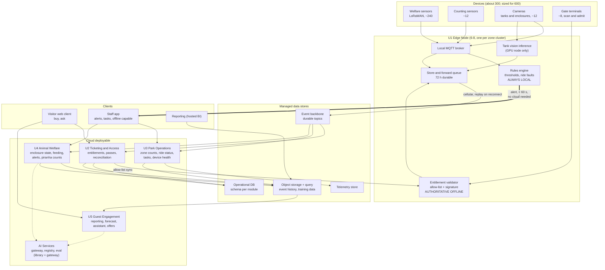

# Containers

## Legend

| Element | Meaning |
| --- | --- |
| Solid arrow | Normal data flow |
| Thick arrow (`==>`) | A path that must work with the cloud unreachable |
| Dashed arrow (`-.->`) | A model call, always with a deterministic fallback (ADR-0012) |
| `U`-prefixed box | One of the five units in [../01-architecture/decomposition.md](../01-architecture/decomposition.md) |
| CLOUD subgraph | One deployable. The boxes inside are modules, not services. |

## What this diagram is asserting

| Assertion | Where it is decided |
| --- | --- |
| Devices never talk to the cloud; the local broker terminates every device connection | ADR-0004 |
| The two paths that must never stop, `VAL` and `SAF`, have no cloud dependency at all | ADR-0003, NFR-AVAIL-1, NFR-SAFE-1 |
| Piranha vision inference runs on the estate, so tank video never crosses the uplink | [../02-ai-capabilities/cap-02-piranha-population.md](../02-ai-capabilities/cap-02-piranha-population.md) |
| AI Services is reachable from exactly two modules, U4 and U5, and from nothing at the edge | [../01-architecture/ai-platform.md](../01-architecture/ai-platform.md), [FF-20](../04-verification/fitness-functions.md#ff-20) |
| Every module writes its own data and reads others' through events or the lake, with no cross-module database access | [../01-architecture/decomposition.md](../01-architecture/decomposition.md) |
| Reporting reads the lake, not the operational database, so a slow report cannot slow the gates | [../01-architecture/core-platform.md](../01-architecture/core-platform.md) |
