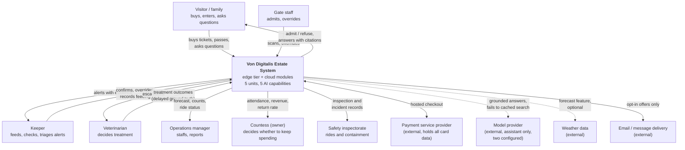

# System context

## Legend

| Element | Meaning |
| --- | --- |
| Solid arrow | Normal flow the system depends on |
| Dashed arrow | An external dependency the system is designed to work without. Both dashed links have declared fallbacks (ADR-0012). |
| Double-headed arrow | Bidirectional exchange |
| External box | Outside our control and outside our operational responsibility (ADR-0005) |

## What this diagram is asserting

| Assertion | Where it is decided |
| --- | --- |
| Card data never enters the system; the PSP holds it | NFR-SEC-1, ADR-0005 |
| Only one external model provider dependency exists, it serves one capability, and it is dashed | ADR-0008, [../02-ai-capabilities/cap-05-guest-companion.md](../02-ai-capabilities/cap-05-guest-companion.md) |
| The veterinarian is inside the loop, not downstream of it: their outcomes are the training signal | ADR-0010, [../02-ai-capabilities/cap-01-animal-welfare-anomaly.md](../02-ai-capabilities/cap-01-animal-welfare-anomaly.md) |
| The visitor is never identified unless they opt in, so no arrow carries visitor identity by default | ADR-0009 |
| The owner is a stakeholder of the system's output, because the decision to continue funding is a real interface | [../00-problem/stakeholders.md](../00-problem/stakeholders.md) |
