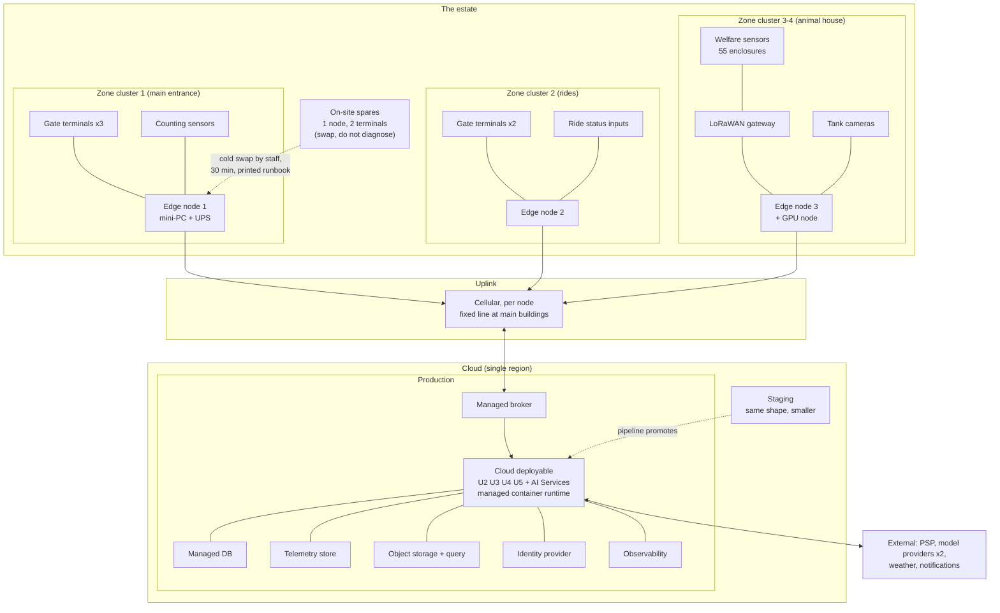

# Deployment

## Legend

| Element | Meaning |
| --- | --- |
| Solid line | A physical or network connection that exists in normal operation |
| Dashed arrow | An operational procedure, not a runtime path (cold swap, pipeline promotion) |
| Subgraph | A physical or logical boundary |
| Zone clusters shown | A representative subset. The full estate is 6-8 nodes and 8 gate terminals (A1, A2); drawing all of them would repeat the same three shapes. Quantities are in [../03-delivery/cost-model.md](../03-delivery/cost-model.md). |

## What this diagram is asserting

| Assertion | Where it is decided |
| --- | --- |
| Two environments only, staging and production | ADR-0005. Two is what a 2-engineer team keeps honest. |
| One cloud region, no multi-region failover | Accepted risk. A regional outage is a degraded day; the edge keeps admitting. [../04-verification/test-strategy.md](../04-verification/test-strategy.md) |
| Spares live on site and recovery is a swap, not a diagnosis | NFR-OPS-2, [FF-13](../04-verification/fitness-functions.md#ff-13) |
| Each node has its own uplink, so one failed link degrades one zone | ADR-0004 |
| The GPU node is one box, in the animal house, next to the tanks it serves | [../03-delivery/cost-model.md](../03-delivery/cost-model.md) |
| No node-to-node links: the cloud is the only meeting point | ADR-0004, D4 |

## Degraded deployment states

| State | What still works | What stops |
| --- | --- | --- |
| One node's uplink down | Everything in that zone: admission, sales, welfare rules, task delivery over local Wi-Fi | Fresh reporting for that zone; the model enrichment layer for its enclosures |
| All uplinks down | All of the above, estate-wide, for 72 hours | Cloud reporting, forecasting, the assistant, offer sending |
| Cloud region down | All of the above | Same as all uplinks down |
| One edge node dead | Other zones unaffected; the dead zone's gates fall back to the on-site spare, then to the printed manual procedure | That zone's telemetry until the swap |
| Cellular contract lapses or coverage fails (A5) | Everything at the edge; buffering extends to 7 days on larger disks | Reporting freshness drops to whatever the replacement uplink allows |
