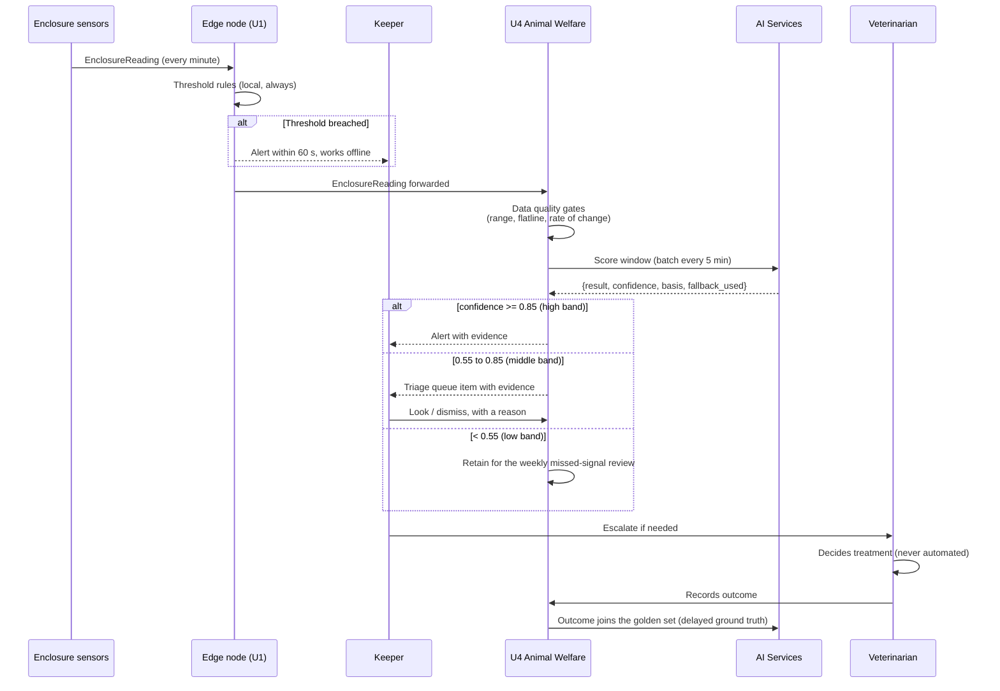
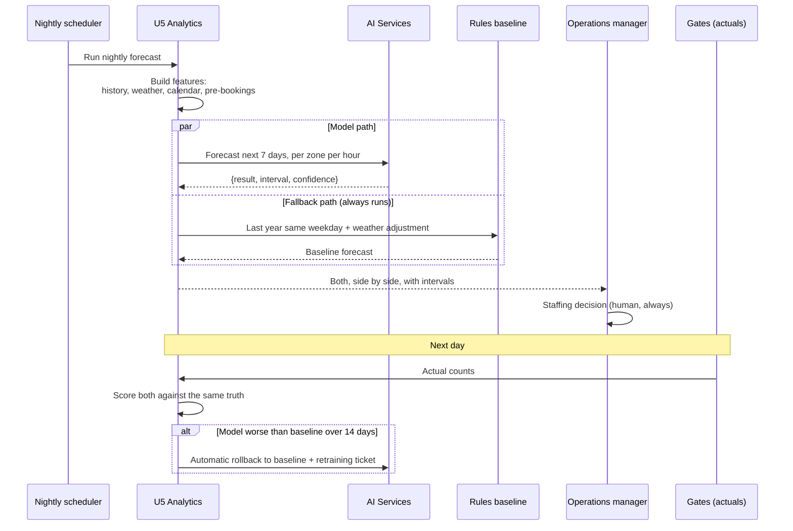

# Sequences

Three flows chosen because each one demonstrates a claim made elsewhere that a static
diagram cannot show.

---

## 1. Offline gate entry and reconciliation

Demonstrates: the gate is authoritative while disconnected, and the cost of that is bounded
and reported (ADR-0003, NFR-AVAIL-1).

```mermaid
sequenceDiagram
  participant V as Visitor
  participant T as Gate terminal
  participant N as Edge node (U1)
  participant U2 as U2 Ticketing (cloud)

  Note over N,U2: Normal operation
  U2->>N: Allow-list for today and tomorrow + revocation delta
  V->>T: Presents signed token
  T->>N: Verify
  N->>N: Check signature, validity window,<br/>local redemption log
  N-->>T: Admit (under 500 ms, NFR-PERF-1)
  T-->>V: Green light
  N->>U2: GateAdmission event

  Note over N,U2: Uplink lost
  V->>T: Presents signed token
  T->>N: Verify
  N->>N: Same check, entirely local
  N-->>T: Admit
  N->>N: Append to local redemption log,<br/>buffer event (72 h capacity)
  T-->>V: Green light + "offline since HH:MM" banner for staff

  Note over N,U2: Uplink returns
  N->>U2: Replay redemptions, oldest first, idempotent
  U2->>U2: Reconcile: detect duplicates across gates,<br/>settle offline sales, apply revocations
  U2-->>N: Acknowledged; refreshed allow-list
  U2->>U2: Reconciliation report:<br/>conflict rate, per gate, per entitlement
```

Legend: dashed replies are responses to the immediately preceding call. The two `Note`
blocks separate the connected and disconnected regimes; the visitor's experience is
identical in both, which is the point.

What this shows that the container diagram cannot: during the outage the node makes a
decision it may later discover was wrong (a revoked entitlement), and the design chooses
that outcome deliberately over refusing a paying visitor. The conflict rate is measured by
[FF-01](../04-verification/fitness-functions.md#ff-01).

---

## 2. Welfare anomaly to veterinary decision

Demonstrates: the rules path and the model path are independent, the model never decides,
and the outcome becomes training data (ADR-0010, ADR-0012).



Legend: `alt` blocks are exclusive branches. The keeper appears twice because the rules path
and the model path reach them independently: if the model is rolled back or the cloud is
unreachable, the first path is unaffected.

What this shows: the vet is inside the loop and their decision is the training signal, which
is why assumption A6 failing removes both the human and the ground truth at once. That is
the reason the A6 playbook cancels the model rather than degrading it.

---

## 3. Forecast to staffing action

Demonstrates: the fallback runs continuously in parallel and both are scored against the
same next-day truth, which is what makes automatic rollback clean here (ADR-0013,
[cap-03](../02-ai-capabilities/cap-03-visitor-flow-forecast.md)).



Legend: the `par` block means both paths run on every execution, not just on failure. That
is unusual, and it is deliberate: the champion-challenger comparison is what makes the
rollback rule objective rather than a judgement call.

What this shows: this is the only capability in the portfolio with fast, cheap, unambiguous
ground truth, so it gets the strongest automatic control. Where that is not available
(welfare, offers), we say so and rely on human adjudication instead. Matching the strength of
the control to the quality of the available feedback is the general rule; see
[../04-verification/ai-validation.md](../04-verification/ai-validation.md).
